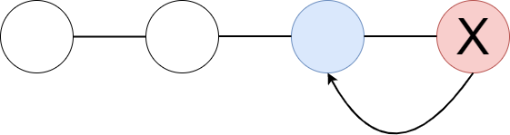
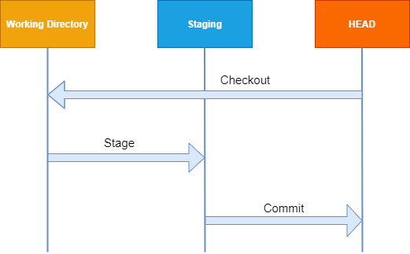

# Reset 

## Definition
Setzt den aktuellen HEAD auf den angegebenen Zustand zurück. Folgende Modis werden für den Reset eingesetzt.
Standardmäßig wird der gemischte Modus verwendet.

|Soft|Mixed (Standard)|Hard|
|----|----------------|----|
|Zeiger auf das angegebene Commit wird gesetztArbeitsbereich und Staging bleibt vorhanden|Sowohl Zeiger als auch Staging werden zurückgesetzt|Wechsel zu einem Commit; Staging wird zurückgesetzt|
|git-reset --soft|git reset|git reset --hard|

|Begriff|Beschreibung|
|-------|------------|
|Working Directory|Arbeitsverzeichnis, an dem gerade gearbeitet wird (Verfolgung git status)|
|Staging|Alle Änderungen in den Dateien wird hier verfolgt und gespeichert (Hinzufügen git add)|
|HEAD|Letzter Coimmit im aktuellen Checkout-Zweig(Zeiger für jede Referenz)|

## Synopsis 

    git reset [-q] [<tree-ish>] [--] <pathspec>
    git reset [-q] [--pathspec-from-file=<file> [--pathspec-file-nul]] [<tree-ish>]
    git reset (--patch | -p) [<tree-ish>] [--] [<pathspec>…​]
    git reset [--soft | --mixed [-N] | --hard | --merge | --keep] [-q] [<commit>]