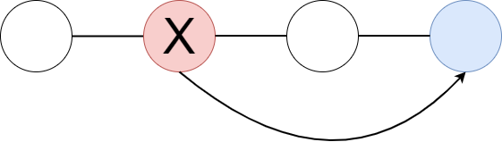

# Revert

## Definition
"Git revert" macht einen bereits vorhanden Commit rückgängig. Allerdings bleibt der vorhandene Commit bestehen und es wird ein neuer Commit erstellt, damit der Projektverlauf nicht unterbrochen wird. 

